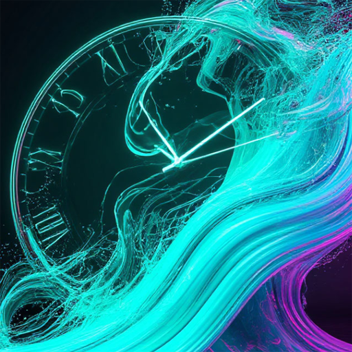
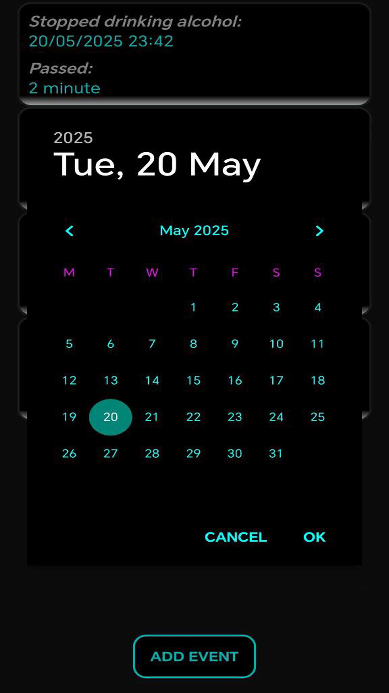

  

# Event Tracker

Event Tracker is a simple and modern Android application with a neon-style interface.  
It allows users to create custom events and track exactly how much time has passed since each one started — down to milliseconds.

Perfect for habits and lifestyle tracking:  
✓ Quit smoking  
✓ Started going to the gym  
✓ Began running in the mornings  
✓ Any personal milestone you want to measure

---

## ✨ Features

- Add unlimited custom events  
- Track the exact time passed (in milliseconds)  
- Neon-style animated interface  
- Clean and minimalistic design  
- Delete events anytime  
- Built with Kotlin

---

## 📷 Screenshots

---

## 🛠 Technologies Used

- Kotlin
- Android Studio
- RecyclerView + Adapters
- Custom Neon UI
- System time (no Firebase required)
- XML Layout

---

## 🚀 How It Works

1. Launch the app  
2. Tap Add Event  
3. Enter a name for your event  
4. The timer starts immediately  
5. Check how long it has been since your milestone  
6. Manage and remove events whenever needed  

---
